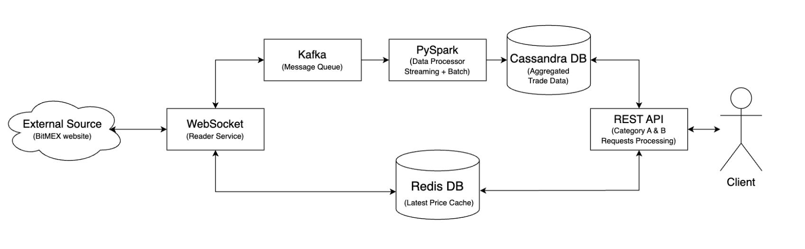

# Project: Crypto Analysis

Authors: 
* **Olha Havryliuk**
* **Yulia Vistak**

---

## 📝 1. Introduction

This project was created to help people better understand and track cryptocurrency prices in real time.\
*(It was really interesting for the authors to deal with the “hype” topic of cryptocurrency for the first time, to learn new terminology and realize how the platform makes money).*

The platform continuously ingests real-time cryptocurrency data from BitMEX website via WebSocket connection. The system processes the data using big data tools (Kafka, PySpark, Cassandra) to get/extract useful infomation. Some of the results are saved in a database and updated regularly, while others are cached in Reddis.

---

## 🧠 2. System Design & Architecture

This section describes the design of the platform. The diagram below represents the system architecture.




#### External Source
The system gets the data from the external source - [BitMEX website](https://www.bitmex.com/). It streams the data to the WebSocket service through the public WebSocket API provided by BitMEX. It streams live cryptocurrency trading data (e.g., prices, trades, volumes, side of trading).

The website provides info about the different cryptocurrencies. The project considers only the following currencies: `ETHUSD, ADAUSD, DOGEUSD, OLUSD, BTCUSD, NBUSD, XRPUSD`

The data updates each time the message about the trade arrived to the system.

#### WebSocket

This is the service that connects to the BitMEX WebSocket and continuously "listens" for trade data. It pulls live data from the BitMEX API and sends it into the internal system (to Kafka Producer or Redis).

#### Kafka (Stream/Batch Processor)
This is a message broker system (message queue) that temporarily stores real-time messages (trades) from the WebSocket client in a distributed and fault-tolerant way.
It buffers incoming streaming data and ensures it's delivered in order to consumer (PySpark).

#### PySpark (Structured Streaming + Batch Jobs)

This is data processing engine. It handles data transformations using Spark and sends the specifically structured data to Cassandraa DB.

PySpark service processes streaming data using the sliding window approach. It processes all messages that were created and arrived within a certain minute, and also collects messages that were created in that minute but arrived a minute later.

#### Cassandra DB (Database)
This is a distributed **NoSQL database** optimized for time-series and large volumes of fast-write data. The service stores **processed historical data** (aggregates) that is needed for batch APIs.

The service collects data in tables that have a specific structure convenient for corresponding queries (more on this in the next section).

#### Redis DB (Cache Database)
This is an in-memory key-value store, extremely fast, typically used as a cache.
It stores **real-time, frequently accessed data** (i.e., latest trade prices) for fast retrieval by APIs.

##### REST API (API Server)
This the server which recieves the requests from other clients and answers them. Through this server clients may use the system.

The server exposes two types of APIs:

  * **Category A** – returns precomputed reports (from Cassandra)
  * **Category B** – handles ad-hoc queries (from Cassandra or Redis)

Allows external clients to access analytics, trends, or live data through HTTP requests.

---

## 🗄️ 3. Data Storage & Modeling

There was used 2 types of storage:
- Cassandra
- Redis

#### Cassandra
The authors chose Cassandra for several reasons:
- **It handles high write throughput**\
  Since the system collects real-time trading data every second, it is important that the data would be processed quickly.
  Cassandra is built to handle large numbers of writes per second without slowing down.\
- **It scales easily**\
  Cassandra is a **distributed database**, so it works well with big data systems.
- **It fast in processing queries**\
  Most queries (last hour’s volumes, current prices) ask for **recent time-series data**.
  Cassandra's **partitioned row storage** model makes it efficient for this.
- **It is often used to store time-series data**

The data in Cassandra DB stores in the following tables
```sql
-- CassandraQL table
CREATE TABLE IF NOT EXISTS minute_aggregates_by_symbol (
      symbol       text,
      window_start timestamp,
      num_trades   int,
      total_volume int,
      PRIMARY KEY ((symbol), window_start)
      );

CREATE TABLE IF NOT EXISTS hourly_aggregates_by_symbol (
      symbol       text,
      window_start timestamp,
      num_trades   int,
      total_volume int,
      PRIMARY KEY ((symbol), window_start)
      );

CREATE TABLE IF NOT EXISTS hourly_volume_ranking (
      window_start timestamp,
      total_volume bigint,
      symbol       text,
      num_trades   bigint,
      PRIMARY KEY ((window_start), total_volume, symbol)
      ) WITH CLUSTERING ORDER BY (total_volume DESC, symbol ASC);
      );
```
The tables look quite simple. However, they cover all requests needed.

#### Redis
Also the Redis DB stores real-time data used for some requests. Its advantages are:
- Provide fast access to real-time data
- Cache frequently requested info
- Reduce load on the main database
- Improve user experience via low-latency APIs

---

## 📡 4. API Documentation

Divide into the required categories:

### 4.1. Category A: Precomputed Report APIs

| Endpoint                    | Method | Description             |
| --------------------------- | ------ | ----------------------- |
| `/reports/hourly-counts` | GET    | Returns the number of transactions for each cryptocurrency for each hour in the last 6 hours, excluding the previous hour.|
| `/reports/volume-6h` | GET    |  Returns the total trading volume for each cryptocurrency for the last 6 hours, excluding the previous hour. |
| `/reports/hourly-count-volume` | GET    | Returns the number of trades and their total volume for each hour in the last 12 hours, excluding the current hour. |

📌 **Examples of requests and responses**

```bash
GET /reports/hourly-counts
```

```json
[
  {
    "symbol": "ETHUSD",
    "hour": "2025-05-17T01:00:00",
    "num_trades": 1410
  },
  {
    "symbol": "ETHUSD",
    "hour": "2025-05-17T02:00:00",
    "num_trades": 906
  },
  {
    "symbol": "ETHUSD",
    "hour": "2025-05-17T03:00:00",
    "num_trades": 221
  },
  {
    "symbol": "ETHUSD",
    "hour": "2025-05-17T04:00:00",
    "num_trades": 440
  },
  {
    "symbol": "ETHUSD",
    "hour": "2025-05-17T05:00:00",
    "num_trades": 296
  },
  {
    "symbol": "ETHUSD",
    "hour": "2025-05-17T06:00:00",
    "num_trades": 253
  },
  {
    "symbol": "ADAUSD",
    "hour": "2025-05-17T01:00:00",
    "num_trades": 379
  },
  {
    "symbol": "ADAUSD",
    "hour": "2025-05-17T02:00:00",
    "num_trades": 904
  },
  {
    "symbol": "ADAUSD",
    "hour": "2025-05-17T03:00:00",
    "num_trades": 439
  },
  {
    "symbol": "ADAUSD",
    "hour": "2025-05-17T04:00:00",
    "num_trades": 418
  },
  {
    "symbol": "ADAUSD",
    "hour": "2025-05-17T05:00:00",
    "num_trades": 342
  },
  {
    "symbol": "ADAUSD",
    "hour": "2025-05-17T06:00:00",
    "num_trades": 269
  },
  {
    "symbol": "DOGEUSD",
    "hour": "2025-05-17T01:00:00",
    "num_trades": 160
  },
  {
    "symbol": "DOGEUSD",
    "hour": "2025-05-17T02:00:00",
    "num_trades": 142
  },
  {
    "symbol": "DOGEUSD",
    "hour": "2025-05-17T03:00:00",
    "num_trades": 57
  },
  {
    "symbol": "DOGEUSD",
    "hour": "2025-05-17T04:00:00",
    "num_trades": 52
  },
  {
    "symbol": "DOGEUSD",
    "hour": "2025-05-17T05:00:00",
    "num_trades": 33
  },
  {
    "symbol": "DOGEUSD",
    "hour": "2025-05-17T06:00:00",
    "num_trades": 39
  },
  {
    "symbol": "SOLUSD",
    "hour": "2025-05-17T01:00:00",
    "num_trades": 348
  },
  {
    "symbol": "SOLUSD",
    "hour": "2025-05-17T02:00:00",
    "num_trades": 215
  },
  {
    "symbol": "SOLUSD",
    "hour": "2025-05-17T03:00:00",
    "num_trades": 120
  },
  {
    "symbol": "SOLUSD",
    "hour": "2025-05-17T04:00:00",
    "num_trades": 131
  },
  {
    "symbol": "SOLUSD",
    "hour": "2025-05-17T05:00:00",
    "num_trades": 192
  },
  {
    "symbol": "SOLUSD",
    "hour": "2025-05-17T06:00:00",
    "num_trades": 105
  },
  {
    "symbol": "BNBUSD",
    "hour": "2025-05-17T01:00:00",
    "num_trades": 11
  },
  {
    "symbol": "BNBUSD",
    "hour": "2025-05-17T02:00:00",
    "num_trades": 3
  },
  {
    "symbol": "BNBUSD",
    "hour": "2025-05-17T03:00:00",
    "num_trades": 10
  },
  {
    "symbol": "BNBUSD",
    "hour": "2025-05-17T06:00:00",
    "num_trades": 12
  },
  {
    "symbol": "XRPUSD",
    "hour": "2025-05-17T01:00:00",
    "num_trades": 677
  },
  {
    "symbol": "XRPUSD",
    "hour": "2025-05-17T02:00:00",
    "num_trades": 2496
  },
  {
    "symbol": "XRPUSD",
    "hour": "2025-05-17T03:00:00",
    "num_trades": 808
  },
  {
    "symbol": "XRPUSD",
    "hour": "2025-05-17T04:00:00",
    "num_trades": 337
  },
  {
    "symbol": "XRPUSD",
    "hour": "2025-05-17T05:00:00",
    "num_trades": 137
  },
  {
    "symbol": "XRPUSD",
    "hour": "2025-05-17T06:00:00",
    "num_trades": 58
  }
]
```

```bash
GET /reports/volume-6h
```

```json
{
  "ETHUSD": 36151,
  "ADAUSD": 91646,
  "DOGEUSD": 14183,
  "SOLUSD": 137986,
  "BTCUSD": 0,
  "BNBUSD": 120,
  "XRPUSD": 25369
}
```
```bash
GET /reports/hourly-count-volume
```

```json
[
  {
    "symbol": "ETHUSD",
    "hour": "2025-05-16T20:00:00",
    "num_trades": 486,
    "total_volume": 6366
  },
  {
    "symbol": "ETHUSD",
    "hour": "2025-05-16T21:00:00",
    "num_trades": 594,
    "total_volume": 12555
  },
  {
    "symbol": "ETHUSD",
    "hour": "2025-05-16T22:00:00",
    "num_trades": 894,
    "total_volume": 12908
  },
  {
    "symbol": "ETHUSD",
    "hour": "2025-05-16T23:00:00",
    "num_trades": 491,
    "total_volume": 7488
  },
  {
    "symbol": "ETHUSD",
    "hour": "2025-05-17T00:00:00",
    "num_trades": 1468,
    "total_volume": 15526
  },
  {
    "symbol": "ETHUSD",
    "hour": "2025-05-17T01:00:00",
    "num_trades": 1410,
    "total_volume": 15748
  },
  {
    "symbol": "ETHUSD",
    "hour": "2025-05-17T02:00:00",
    "num_trades": 906,
    "total_volume": 10011
  },
  {
    "symbol": "ETHUSD",
    "hour": "2025-05-17T03:00:00",
    "num_trades": 221,
    "total_volume": 2677
  },
  {
    "symbol": "ETHUSD",
    "hour": "2025-05-17T04:00:00",
    "num_trades": 440,
    "total_volume": 3139
  },
  {
    "symbol": "ETHUSD",
    "hour": "2025-05-17T05:00:00",
    "num_trades": 296,
    "total_volume": 1772
  },
  {
    "symbol": "ETHUSD",
    "hour": "2025-05-17T06:00:00",
    "num_trades": 253,
    "total_volume": 2804
  },
  {
    "symbol": "ADAUSD",
    "hour": "2025-05-16T20:00:00",
    "num_trades": 219,
    "total_volume": 88444
  },
  {
    "symbol": "ADAUSD",
    "hour": "2025-05-16T21:00:00",
    "num_trades": 62,
    "total_volume": 6654
  },
  {
    "symbol": "ADAUSD",
    "hour": "2025-05-16T22:00:00",
    "num_trades": 215,
    "total_volume": 55845
  },
  {
    "symbol": "ADAUSD",
    "hour": "2025-05-16T23:00:00",
    "num_trades": 104,
    "total_volume": 15230
  },
  {
    "symbol": "ADAUSD",
    "hour": "2025-05-17T00:00:00",
    "num_trades": 272,
    "total_volume": 88064
  },
  {
    "symbol": "ADAUSD",
    "hour": "2025-05-17T01:00:00",
    "num_trades": 379,
    "total_volume": 25009
  },
  {
    "symbol": "ADAUSD",
    "hour": "2025-05-17T02:00:00",
    "num_trades": 904,
    "total_volume": 23490
  },
  {
    "symbol": "ADAUSD",
    "hour": "2025-05-17T03:00:00",
    "num_trades": 439,
    "total_volume": 14788
  },
  {
    "symbol": "ADAUSD",
    "hour": "2025-05-17T04:00:00",
    "num_trades": 418,
    "total_volume": 11692
  },
  {
    "symbol": "ADAUSD",
    "hour": "2025-05-17T05:00:00",
    "num_trades": 342,
    "total_volume": 9264
  },
  {
    "symbol": "ADAUSD",
    "hour": "2025-05-17T06:00:00",
    "num_trades": 269,
    "total_volume": 7403
  },
  {
    "symbol": "DOGEUSD",
    "hour": "2025-05-16T20:00:00",
    "num_trades": 301,
    "total_volume": 51531
  },
  {
    "symbol": "DOGEUSD",
    "hour": "2025-05-16T21:00:00",
    "num_trades": 82,
    "total_volume": 5077
  },
  {
    "symbol": "DOGEUSD",
    "hour": "2025-05-16T22:00:00",
    "num_trades": 163,
    "total_volume": 7288
  },
  {
    "symbol": "DOGEUSD",
    "hour": "2025-05-16T23:00:00",
    "num_trades": 43,
    "total_volume": 1850
  },
  {
    "symbol": "DOGEUSD",
    "hour": "2025-05-17T00:00:00",
    "num_trades": 265,
    "total_volume": 16205
  },
  {
    "symbol": "DOGEUSD",
    "hour": "2025-05-17T01:00:00",
    "num_trades": 160,
    "total_volume": 3631
  },
  {
    "symbol": "DOGEUSD",
    "hour": "2025-05-17T02:00:00",
    "num_trades": 142,
    "total_volume": 6167
  },
  {
    "symbol": "DOGEUSD",
    "hour": "2025-05-17T03:00:00",
    "num_trades": 57,
    "total_volume": 1707
  },
  {
    "symbol": "DOGEUSD",
    "hour": "2025-05-17T04:00:00",
    "num_trades": 52,
    "total_volume": 1617
  },
  {
    "symbol": "DOGEUSD",
    "hour": "2025-05-17T05:00:00",
    "num_trades": 33,
    "total_volume": 279
  },
  {
    "symbol": "DOGEUSD",
    "hour": "2025-05-17T06:00:00",
    "num_trades": 39,
    "total_volume": 782
  },
  {
    "symbol": "SOLUSD",
    "hour": "2025-05-16T20:00:00",
    "num_trades": 232,
    "total_volume": 29774
  },
  {
    "symbol": "SOLUSD",
    "hour": "2025-05-16T21:00:00",
    "num_trades": 75,
    "total_volume": 14069
  },
  {
    "symbol": "SOLUSD",
    "hour": "2025-05-16T22:00:00",
    "num_trades": 227,
    "total_volume": 20956
  },
  {
    "symbol": "SOLUSD",
    "hour": "2025-05-16T23:00:00",
    "num_trades": 167,
    "total_volume": 24564
  },
  {
    "symbol": "SOLUSD",
    "hour": "2025-05-17T00:00:00",
    "num_trades": 360,
    "total_volume": 34612
  },
  {
    "symbol": "SOLUSD",
    "hour": "2025-05-17T01:00:00",
    "num_trades": 348,
    "total_volume": 35726
  },
  {
    "symbol": "SOLUSD",
    "hour": "2025-05-17T02:00:00",
    "num_trades": 215,
    "total_volume": 37131
  },
  {
    "symbol": "SOLUSD",
    "hour": "2025-05-17T03:00:00",
    "num_trades": 120,
    "total_volume": 12285
  },
  {
    "symbol": "SOLUSD",
    "hour": "2025-05-17T04:00:00",
    "num_trades": 131,
    "total_volume": 14790
  },
  {
    "symbol": "SOLUSD",
    "hour": "2025-05-17T05:00:00",
    "num_trades": 192,
    "total_volume": 23644
  },
  {
    "symbol": "SOLUSD",
    "hour": "2025-05-17T06:00:00",
    "num_trades": 105,
    "total_volume": 14410
  },
  {
    "symbol": "BNBUSD",
    "hour": "2025-05-16T20:00:00",
    "num_trades": 16,
    "total_volume": 28
  },
  {
    "symbol": "BNBUSD",
    "hour": "2025-05-16T22:00:00",
    "num_trades": 10,
    "total_volume": 76
  },
  {
    "symbol": "BNBUSD",
    "hour": "2025-05-16T23:00:00",
    "num_trades": 3,
    "total_volume": 11
  },
  {
    "symbol": "BNBUSD",
    "hour": "2025-05-17T00:00:00",
    "num_trades": 8,
    "total_volume": 28
  },
  {
    "symbol": "BNBUSD",
    "hour": "2025-05-17T01:00:00",
    "num_trades": 11,
    "total_volume": 20
  },
  {
    "symbol": "BNBUSD",
    "hour": "2025-05-17T02:00:00",
    "num_trades": 3,
    "total_volume": 5
  },
  {
    "symbol": "BNBUSD",
    "hour": "2025-05-17T03:00:00",
    "num_trades": 10,
    "total_volume": 58
  },
  {
    "symbol": "BNBUSD",
    "hour": "2025-05-17T06:00:00",
    "num_trades": 12,
    "total_volume": 37
  },
  {
    "symbol": "XRPUSD",
    "hour": "2025-05-16T20:00:00",
    "num_trades": 531,
    "total_volume": 59897
  },
  {
    "symbol": "XRPUSD",
    "hour": "2025-05-16T21:00:00",
    "num_trades": 764,
    "total_volume": 5540
  },
  {
    "symbol": "XRPUSD",
    "hour": "2025-05-16T22:00:00",
    "num_trades": 908,
    "total_volume": 16242
  },
  {
    "symbol": "XRPUSD",
    "hour": "2025-05-16T23:00:00",
    "num_trades": 934,
    "total_volume": 2830
  },
  {
    "symbol": "XRPUSD",
    "hour": "2025-05-17T00:00:00",
    "num_trades": 1495,
    "total_volume": 22858
  },
  {
    "symbol": "XRPUSD",
    "hour": "2025-05-17T01:00:00",
    "num_trades": 677,
    "total_volume": 8485
  },
  {
    "symbol": "XRPUSD",
    "hour": "2025-05-17T02:00:00",
    "num_trades": 2496,
    "total_volume": 7599
  },
  {
    "symbol": "XRPUSD",
    "hour": "2025-05-17T03:00:00",
    "num_trades": 808,
    "total_volume": 5858
  },
  {
    "symbol": "XRPUSD",
    "hour": "2025-05-17T04:00:00",
    "num_trades": 337,
    "total_volume": 1968
  },
  {
    "symbol": "XRPUSD",
    "hour": "2025-05-17T05:00:00",
    "num_trades": 137,
    "total_volume": 573
  },
  {
    "symbol": "XRPUSD",
    "hour": "2025-05-17T06:00:00",
    "num_trades": 58,
    "total_volume": 886
  }
]
```

### 4.2. Category B: Ad-hoc Query APIs

| Endpoint                     | Method | Output                          |
| ---------------------------- | ------ | ------------------------------------ |
| `/query/{symbol}/trades` | GET    | Returns the number of trades processed in a cryptocurrency {symbol} in the last N minutes, excluding the last minute. |
| `/query/top-volume` | GET    | Returns the top N cryptocurrencies with the highest trading volume in the last hour. |
| `/query/{symbol}/price` | GET    | Return the cryptocurrency’s current price for «Buy» and «Sell» sides based on its {symbol}. |

📌 **Examples of requests and responses**

```bash
GET http://localhost:8000/query/ADAUSD/trades?minutes=40
```

```json
{
  "symbol": "ADAUSD",
  "minutes": 40,
  "num_trades": 4
}
```

```bash
GET /query/top-volume
```

```json
{
  "symbol": "XBTUSD",
  "price_change_percent": 4.25
}
```
```bash
GET http://localhost:8000/query/ADAUSD/price
```

```json
{
  "symbol": "ADAUSD",
  "buy": 0.7654,
  "sell": 0.7653
}
```

---

## 🧪 5. Results After System Run

After ruuning the system during $$$ hours, the folloowing results are obtained.

```md


```

---

## 🧰 6. Source Code Structure

The project directory layout:

```text
📦 project-root
├── api/                       # REST API server, serves user requests from Redis or Cassandra
│   ├── Dockerfile             # Docker config for API service
│   ├── requirements.txt       # Dependencies for the API service
│   └── to_api.py              # Main script for handling REST API endpoints
│
├── bitmex-reader/             # WebSocket client that reads data from BitMEX and sends to Kafka
│   ├── Dockerfile             # Docker config for the BitMEX reader
│   ├── requirements.txt       # Dependencies for the BitMEX reader
│   └── to_kafka.py            # Script to connect to WebSocket and produce Kafka messages
│
├── spark-job/                 # PySpark job to consume from Kafka and write to Cassandra
│   ├── Dockerfile             # Docker config for Spark job
│   └── to_cassandra.py        # Spark script for stream processing and storing in Cassandra
│
├── schema/                   # Initialization scripts for database setup
│   ├── init_cassandra.cql    # CQL schema definitions for Cassandra tables
│   ├── init-cassandra.sh     # Script to apply Cassandra schema
│   └── init-kafka.sh         # Script to configure/start Kafka topics
│
├── docker-compose.yml         # Orchestrates all services using Docker
├── images/                    # Results, screenshots for README.md
│   ├── crypto-analysis-architecture.png    # Diagram of the system architecture
│   ├── 
│   └── 
└── README.md
```

---

## 🔧 7. Setup & Configuration

`docker-compose.yaml` describes all necessary containers for diffirent components. Meaning, it is quite easy to setup the project, just use command:
```bash
docker-compose.yaml
```
---

## 🧪 8. Testing Instructions

* How you tested API endpoints
* Tools used (e.g., Postman, curl)
* Any unit/integration tests

After setup step, let us verify that the system works correctly and API endpoints respond as expected.

You just may open `localhost:8000/` in **Swagger** or **Postman**, or use **curl** commands for it

Examples:
```bash
curl http://localhost:8000/reports/volume-6h
curl http://localhost:8000/query/{symbol}/price
```


